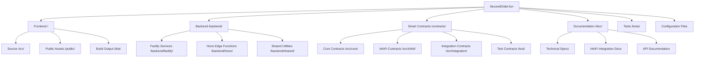

# SecondOrder.fun Project Structure Documentation (Updated with InfoFi Integration)

## Overview

SecondOrder.fun is a full-stack Web3 application that transforms cryptocurrency speculation into structured, fair finite games through applied game theory enhanced with InfoFi (Information Finance) integration. The platform combines transparent raffle mechanics with sophisticated prediction markets to create a multi-layer system enabling cross-layer strategies, real-time arbitrage opportunities, and information-based value creation.

## Technology Stack Enhanced with InfoFi Integration

### Frontend

- **Framework**: React 18 with Vite 6.2.6 for fast development and optimized builds
- **Language**: JavaScript with JSDoc (TypeScript-ready) for rapid development with type safety
- **Styling**: Tailwind CSS with shadcn/ui components optimized for InfoFi market interfaces
- **Web3**: Wagmi + Viem for Ethereum interactions across raffle and InfoFi contracts
- **Authentication**: Farcaster Auth Kit + RainbowKit with enhanced permissions for InfoFi trading
- **State Management**: React Query + Context API optimized for real-time InfoFi market data
- **Real-Time**: Server-Sent Events (SSE) for live pricing updates and arbitrage opportunity detection
- **Routing**: React Router DOM v7 with InfoFi market deep-linking support

### Backend Enhanced with InfoFi Services

- **Framework**: Fastify (main services) + Hono (edge functions) with InfoFi market optimization
- **Architecture**: Hybrid deployment with clear separation between raffle and InfoFi concerns
- **Language**: JavaScript (ES Modules) with TypeScript support for complex InfoFi calculations
- **Database**: Supabase (PostgreSQL) with real-time pub/sub enhanced for InfoFi market coordination
- **Real-time**: Server-Sent Events (SSE) transport for streaming on-chain oracle values and arbitrage alerts
- **Authentication**: JWT + Farcaster integration with InfoFi market permissions
- **InfoFi Services**: Oracle streaming of on-chain hybrid price, arbitrage detection, settlement coordination

### Smart Contracts Enhanced with InfoFi Integration

- **Language**: Solidity ^0.8.20 with OpenZeppelin security patterns
- **Framework**: Foundry for development, testing, and deployment with multi-contract coordination
- **Networks**: Base (primary), Ethereum, Arbitrum, Polygon with InfoFi market support
- **Oracles**: Chainlink VRF + Keepers with enhanced InfoFi settlement coordination
- **Architecture**: Custom bonding curves + InfoFi market contracts with VRF-triggered atomic settlement
- **Security**: OpenZeppelin AccessControl, ReentrancyGuard across all InfoFi integrations

## Project Root Structure Enhanced for InfoFi



#### Smart Contracts Directory Breakdown

```bash
contracts/src/
├── core/
│   ├── Raffle.sol              # Main raffle contract, manages seasons and VRF
│   ├── SeasonFactory.sol       # Deploys seasonal contracts (RaffleToken, SOFBondingCurve)
│   ├── ISeasonFactory.sol      # Interface for SeasonFactory
│   └── IRaffle.sol             # Interface for Raffle
├── curve/
│   └── SOFBondingCurve.sol     # Stepped linear bonding curve for ticket-tokens
├── infofi/
│   └── InfoFiMarket.sol        # Prediction market contract (placeholder)
├── lib/
│   ├── RaffleLogic.sol         # Shared logic for raffle mechanics
│   └── RaffleStorage.sol       # Shared storage structs for raffle state
└── token/
    ├── SOFToken.sol            # The main project token ($SOF)
    └── RaffleToken.sol         # Per-season ticket token (ERC20)
```

## Detailed Directory Structure Enhanced with InfoFi

### Root Level Files

```bash
secondorderfun/
├── package.json                 # Frontend dependencies & scripts with InfoFi libraries
├── package-lock.json           # Dependency lock file
├── vite.config.js              # Vite build configuration with InfoFi asset optimization
├── vitest.config.js            # Test configuration enhanced for InfoFi components
├── tailwind.config.js          # Tailwind CSS configuration with InfoFi market themes
├── postcss.config.js           # PostCSS configuration
├── eslint.config.js            # ESLint configuration with InfoFi code patterns
├── jsconfig.json               # JavaScript configuration with InfoFi path mappings
├── components.json              # shadcn/ui component configuration with InfoFi extensions
├── vercel.json                 # Vercel deployment configuration with InfoFi edge functions
├── .env                        # Environment variables (local) with InfoFi API keys
├── .gitignore                  # Git ignore patterns enhanced for InfoFi artifacts
├── README.md                   # Project overview & setup with InfoFi integration guide
├── index.html                  # Main HTML entry point with InfoFi meta tags
└── 404.html                    # 404 error page
```

### Frontend Structure Enhanced with InfoFi (/src/)

```mermaid
graph TD
    A[/src/] --> B[/app/]
    A --> C[/assets/]
    A --> D[/components/]
    A --> E[/context/]
    A --> F[/contracts/]
    A --> G[/features/]
    A --> H[/hooks/]
    A --> I[/layouts/]
    A --> J[/lib/]
    A --> K[/pages/]
    A --> L[/services/]
    A --> M[/styles/]
    A --> N[/types/]
    A --> O[/utils/]

    D --> D1[/ui/ - shadcn components]
    D --> D2[/common/ - Shared components]
    D --> D3[/raffle/ - Raffle components]
    D --> D4[/infofi/ - InfoFi market components]
    D --> D5[/crosslayer/ - Cross-layer strategy components]
    D --> D6[/layout/ - Layout components]

    G --> G1[/raffle/ - Enhanced raffle features]
    G --> G2[/infofi/ - InfoFi market features]
    G --> G3[/arbitrage/ - Arbitrage detection features]
    G --> G4[/crosslayer/ - Cross-layer strategy features]
    G --> G5[/dashboard/ - Enhanced user dashboard]
    G --> G6[/auth/ - Authentication with InfoFi permissions]
```

#### Frontend Directory Breakdown Enhanced for InfoFi

```bash
src/
├── app/
│   ├── App.jsx                 # Main application component with InfoFi routing
│   ├── Router.jsx              # Application routing with InfoFi market routes
│   └── index.js                # Application entry point
│
├── assets/
│   ├── images/                 # Image assets with InfoFi market icons
│   ├── icons/                  # Icon assets including arbitrage and strategy icons
│   └── fonts/                  # Font files optimized for InfoFi data display
│
├── components/
│   ├── ui/                     # shadcn/ui base components enhanced for InfoFi
│   │   ├── button.jsx          # Enhanced with loading states for InfoFi operations
│   │   ├── input.jsx           # Enhanced for numerical InfoFi market inputs
│   │   ├── card.jsx            # Optimized for InfoFi market data display
│   │   ├── dialog.jsx          # Enhanced for InfoFi transaction confirmations
│   │   ├── chart.jsx           # NEW: InfoFi market charts and probability visualization
│   │   ├── realtime-badge.jsx  # NEW: Live update indicators
│   │   └── arbitrage-alert.jsx # NEW: Arbitrage opportunity notifications
│   │
│   ├── common/                 # Shared components enhanced for multi-layer usage
│   │   ├── ErrorBoundary.jsx   # Enhanced error handling for InfoFi operations
│   │   ├── LoadingSpinner.jsx  # Multi-state loading for complex operations
│   │   ├── MessageDisplay.jsx  # Enhanced messaging for InfoFi notifications
│   │   ├── Pagination.jsx      # Enhanced for InfoFi market lists
│   │   ├── RealTimeStatus.jsx  # NEW: Connection status for live data
│   │   └── CrossLayerIndicator.jsx # NEW: Multi-layer position indicators
│   │
│   ├── layout/                 # Layout components enhanced for InfoFi navigation
│   │   ├── DashboardLayout.jsx # Enhanced with InfoFi market sidebar
│   │   ├── DashboardSidebar.jsx # InfoFi market navigation integration
│   │   ├── Header.jsx          # Enhanced with InfoFi market quick access
│   │   ├── Footer.jsx          # InfoFi market status indicators
│   │   └── InfoFiNavigation.jsx # NEW: InfoFi-specific navigation component
│   │
│   ├── raffle/                 # Raffle-specific components enhanced with InfoFi
│   │   ├── RaffleCard.jsx      # Enhanced with InfoFi market integration indicators
│   │   ├── RaffleDetailsPanel.jsx # InfoFi market links and arbitrage opportunities
│   │   ├── RaffleSummary.jsx   # Cross-layer position summary display
│   │   ├── CreateRaffleForm.jsx # Enhanced with InfoFi market configuration
│   │   ├── PositionTracker.jsx # Real-time sliding window position with InfoFi integration
│   │   └── CrossLayerStrategy.jsx # NEW: Multi-layer strategy coordination
│   │
│   ├── infofi/                 # NEW: InfoFi market-specific components
│   │   ├── InfoFiMarketCard.jsx # Individual market display with real-time pricing
│   │   ├── MarketList.jsx      # List of active InfoFi markets with filtering
│   │   ├── ProbabilityChart.jsx # Live probability visualization and history
│   │   ├── TradingInterface.jsx # InfoFi market trading with order placement
│   │   ├── MarketDepth.jsx     # Order book and liquidity visualization
│   │   ├── PriceHistory.jsx    # Historical price charts with volume data
│   │   ├── SettlementStatus.jsx # Settlement progress and countdown timers
│   │   ├── WinningsPanel.jsx   # Claim interface for settled market winnings
│   │   └── HybridPricing.jsx   # 70%/30% pricing breakdown visualization
│   │
│   ├── arbitrage/              # NEW: Arbitrage detection and execution components
│   │   ├── OpportunityDisplay.jsx # Real-time arbitrage opportunity cards
│   │   ├── OpportunityList.jsx # Filterable list of all opportunities
│   │   ├── ExecutionInterface.jsx # One-click arbitrage execution tools
│   │   ├── ProfitCalculator.jsx # Profit estimation and risk assessment
│   │   ├── HistoryTracker.jsx  # Historical arbitrage performance tracking
│   │   └── AlertSystem.jsx     # Push notifications for new opportunities
│   │
│   ├── crosslayer/             # NEW: Cross-layer strategy components
│   │   ├── StrategyPanel.jsx   # Multi-layer strategy selection and configuration
│   │   ├── HedgeCalculator.jsx # Hedge strategy profit/loss calculations
│   │   ├── PositionManager.jsx # Unified position management across layers
│   │   ├── PerformanceTracker.jsx # Cross-layer strategy performance analytics
│   │   ├── RiskAssessment.jsx  # Risk analysis for complex strategies
│   │   └── StrategyRecommendations.jsx # AI-driven strategy suggestions
│   │
│   ├── bondingcurve/          # Enhanced bonding curve components
│   │   ├── BondingCurveChart.jsx # Enhanced with InfoFi arbitrage indicators
│   │   ├── BuyTokensForm.jsx   # Enhanced with cross-layer strategy options
│   │   ├── PositionTracker.jsx # Real-time position with InfoFi market correlation
│   │   └── ArbitrageIndicator.jsx # NEW: Real-time arbitrage opportunity overlay
│   │
│   └── sandbox/               # Development sandbox components with InfoFi testing
│
├── context/
│   ├── AuthContext.jsx        # Enhanced authentication with InfoFi permissions
│   ├── Web3Context.jsx        # Enhanced Web3 connection with multi-contract support
│   ├── RaffleContext.jsx      # Enhanced raffle state with InfoFi integration
│   ├── InfoFiContext.jsx      # NEW: InfoFi market state management
│   ├── ArbitrageContext.jsx   # NEW: Arbitrage opportunity state management
│   ├── CrossLayerContext.jsx  # NEW: Cross-layer strategy coordination
│   ├── RealTimeContext.jsx    # NEW: SSE connection and live data management
│   └── NotificationContext.jsx # Enhanced notification system with InfoFi alerts
│
├── contracts/
│   ├── abis/                  # Contract ABIs for all integrated contracts
│   │   ├── RaffleBondingCurve.json # Enhanced raffle contract ABI
│   │   ├── InfoFiMarketFactory.json # NEW: InfoFi market factory ABI
│   │   ├── InfoFiPriceOracle.json   # NEW: Hybrid pricing oracle ABI
│   │   ├── InfoFiSettlement.json    # NEW: Settlement coordination ABI
│   │   └── AccessControl.json       # OpenZeppelin AccessControl ABI
│   ├── addresses.js           # Contract addresses by network with InfoFi contracts
│   ├── RaffleBondingCurve.js  # Enhanced bonding curve contract interface
│   ├── InfoFiMarketFactory.js # NEW: InfoFi market factory interface
│   ├── InfoFiPriceOracle.js   # NEW: Hybrid pricing oracle interface
│   ├── InfoFiSettlement.js    # NEW: Settlement coordination interface
│   └── CrossContractCoordinator.js # NEW: Multi-contract coordination utilities
│
├── features/
│   ├── raffle/                # Enhanced raffle features with InfoFi integration
│   │   ├── components/        # Raffle components with InfoFi awareness
│   │   ├── hooks/            # Enhanced raffle hooks with InfoFi coordination
│   │   ├── services/         # Enhanced raffle services with cross-layer support
│   │   └── types.js          # Enhanced raffle types with InfoFi integration
│   │
│   ├── infofi/               # NEW: InfoFi market features
│   │   ├── components/        # InfoFi market-specific components
│   │   │   ├── MarketCard.jsx     # Individual market display
│   │   │   ├── TradingForm.jsx    # Market position entry interface
│   │   │   ├── SettlementTracker.jsx # Settlement countdown and status
│   │   │   └── WinningsClaimForm.jsx # Winnings claim interface
│   │   ├── hooks/            # InfoFi market hooks
│   │   │   ├── useInfoFiMarkets.js    # Market data fetching and caching
│   │   │   ├── useHybridPricing.js    # Real-time oracle reads + SSE streaming of hybrid price
│   │   │   ├── useMarketTrading.js    # Trading operations and validation
│   │   │   ├── useSettlement.js       # Settlement tracking and claims
│   │   │   └── useMarketAnalytics.js  # Market performance analytics
│   │   ├── services/         # InfoFi market business logic
│   │   │   ├── infoFiMarketService.js  # CRUD operations for markets
│   │   │   ├── hybridPricingService.js # NEW: Oracle reader + SSE publisher for on-chain hybrid price
│   │   │   ├── settlementService.js    # Settlement coordination service
│   │   │   └── analyticsService.js     # Market analytics and reporting
│   │   └── types.js          # InfoFi market type definitions
│   │
│   ├── arbitrage/            # NEW: Arbitrage detection features
│   │   ├── components/        # Arbitrage-specific components
│   │   │   ├── OpportunityCard.jsx    # Individual arbitrage opportunity display
│   │   │   ├── ExecutionForm.jsx      # Arbitrage execution interface
│   │   │   ├── ProfitEstimator.jsx    # Real-time profit calculations
│   │   │   └── HistoryDisplay.jsx     # Historical performance tracking
│   │   ├── hooks/            # Arbitrage detection hooks
│   │   │   ├── useArbitrageOpportunities.js # Real-time opportunity detection
│   │   │   ├── useArbitrageExecution.js     # Execution coordination
│   │   │   ├── useProfitCalculation.js      # Profit/loss estimation
│   │   │   └── useArbitrageHistory.js       # Historical performance tracking
│   │   ├── services/         # Arbitrage business logic
│   │   │   ├── arbitrageDetectionService.js # Opportunity detection algorithms
│   │   │   ├── executionService.js          # Strategy execution coordination
│   │   │   └── historyService.js            # Performance tracking service
│   │   └── types.js          # Arbitrage-related type definitions
│   │
│   ├── crosslayer/           # NEW: Cross-layer strategy features
│   │   ├── components/        # Cross-layer strategy components
│   │   │   ├── StrategySelector.jsx   # Strategy type selection interface
│   │   │   ├── HedgeCalculator.jsx    # Hedge strategy configuration
│   │   │   ├── PositionOverview.jsx   # Multi-layer position summary
│   │   │   └── PerformanceAnalytics.jsx # Strategy performance tracking
│   │   ├── hooks/            # Cross-layer strategy hooks
│   │   │   ├── useCrossLayerStrategy.js  # Multi-layer strategy coordination
│   │   │   ├── useHedgeStrategy.js       # Hedge strategy management
│   │   │   ├── usePositionSync.js        # Position synchronization across layers
│   │   │   └── useStrategyAnalytics.js   # Performance analytics and optimization
│   │   ├── services/         # Cross-layer business logic
│   │   │   ├── strategyCoordinationService.js # Multi-layer strategy management
│   │   │   ├── hedgeCalculationService.js     # Hedge strategy calculations
│   │   │   └── performanceAnalyticsService.js # Strategy performance analysis
│   │   └── types.js          # Cross-layer strategy type definitions
│   │
│   ├── dashboard/            # Enhanced dashboard features with InfoFi integration
│   │   ├── components/        # Dashboard components with multi-layer support
│   │   │   ├── PortfolioOverview.jsx  # Multi-layer portfolio summary
│   │   │   ├── PerformanceChart.jsx   # Cross-layer performance visualization
│   │   │   ├── ActivityFeed.jsx       # Real-time activity across all layers
│   │   │   └── StrategyInsights.jsx   # AI-driven strategy recommendations
│   │   ├── hooks/            # Enhanced dashboard hooks
│   │   │   ├── usePortfolioData.js     # Multi-layer portfolio aggregation
│   │   │   ├── usePerformanceMetrics.js # Cross-layer performance calculations
│   │   │   └── useActivityTracking.js   # Real-time activity monitoring
│   │   └── services/         # Enhanced dashboard services
│   │       ├── portfolioAggregationService.js # Multi-layer data aggregation
│   │       └── performanceAnalyticsService.js # Cross-layer analytics
│   │
│   └── auth/                 # Enhanced authentication features
│       ├── components/        # Authentication components with InfoFi permissions
│       ├── hooks/            # Enhanced auth hooks with permission management
│       └── services/         # Enhanced auth services with InfoFi integration
│
├── hooks/
│   ├── useAuth.js            # Enhanced authentication with InfoFi permissions
│   ├── useContract.js        # Enhanced smart contract interaction for multi-contract coordination
│   ├── useRaffle.js          # Enhanced raffle state with InfoFi integration
│   ├── useInfoFiMarkets.js   # NEW: InfoFi market data management
│   ├── useArbitrageDetection.js # NEW: Real-time arbitrage opportunity detection
│   ├── useCrossLayerStrategy.js # NEW: Multi-layer strategy coordination
│   ├── useHybridPricing.js   # NEW: Real-time oracle reads + SSE streaming of hybrid price
│   ├── useRealTimeData.js    # NEW: SSE connection management for live updates
│   ├── useSettlement.js      # NEW: VRF-coordinated settlement tracking
│   ├── useLocalStorage.js    # Enhanced local storage with InfoFi preferences
│   ├── useWebSocket.js       # Enhanced for InfoFi real-time connections
│   └── usePerformanceTracking.js # NEW: Cross-layer performance analytics
│
├── layouts/
│   ├── MainLayout.jsx        # Enhanced main layout with InfoFi navigation
│   ├── DashboardLayout.jsx   # Enhanced dashboard with InfoFi market sidebar
│   ├── InfoFiLayout.jsx      # NEW: InfoFi market-focused layout
│   ├── TradingLayout.jsx     # NEW: Full-screen trading interface layout
│   ├── FrameLayout.jsx       # Enhanced Farcaster Frame with InfoFi integration
│   └── AuthLayout.jsx        # Enhanced authentication with InfoFi permissions
│
├── lib/
│   ├── wagmi.js              # Enhanced Wagmi configuration with InfoFi contracts
│   ├── viem.js               # Enhanced Viem client with multi-contract support
│   ├── farcaster.js          # Enhanced Farcaster SDK with InfoFi sharing
│   ├── supabase.js           # Enhanced Supabase client with InfoFi schema
│   ├── realtime.js           # NEW: SSE client configuration and management
│   ├── infofi.js             # NEW: InfoFi market utilities and helpers
│   ├── arbitrage.js          # NEW: Arbitrage detection and execution utilities
│   ├── crosslayer.js         # NEW: Cross-layer strategy coordination utilities
│   └── utils.js              # Enhanced utility functions with InfoFi calculations
│
├── pages/
│   ├── LandingPage.jsx       # Enhanced landing page with InfoFi value proposition
│   ├── BrowseRafflesPage.jsx # Enhanced raffle browsing with InfoFi market integration
│   ├── CreateRafflePage.jsx  # Enhanced raffle creation with InfoFi configuration
│   ├── RaffleDetailsPage.jsx # Enhanced individual raffle with InfoFi markets
│   ├── InfoFiMarketsPage.jsx # NEW: InfoFi market overview and discovery
│   ├── TradingPage.jsx       # NEW: Full-screen InfoFi trading interface
│   ├── ArbitragePage.jsx     # NEW: Arbitrage opportunity dashboard
│   ├── CrossLayerStrategyPage.jsx # NEW: Multi-layer strategy management
│   ├── DashboardPage.jsx     # Enhanced user dashboard with InfoFi integration
│   ├── ProfilePage.jsx       # Enhanced user profile with InfoFi statistics
│   ├── AnalyticsPage.jsx     # NEW: Advanced analytics and performance tracking
│   ├── FrameRafflePage.jsx   # Enhanced Farcaster Frame with InfoFi integration
│   └── SandboxPage.jsx       # Enhanced development sandbox with InfoFi testing
│
├── services/
│   ├── api.js                # Enhanced API client with InfoFi endpoints
│   ├── raffleService.js      # Enhanced raffle operations with InfoFi coordination
│   ├── infoFiMarketService.js # NEW: InfoFi market CRUD operations
│   ├── arbitrageService.js   # NEW: Arbitrage detection and execution service
│   ├── crossLayerService.js  # NEW: Cross-layer strategy coordination service
│   ├── hybridPricingService.js # NEW: Oracle reader + SSE publisher for on-chain hybrid price
│   ├── settlementService.js  # NEW: VRF-coordinated settlement service
│   ├── realTimeService.js    # NEW: SSE connection and data streaming service
│   ├── userService.js        # Enhanced user operations with InfoFi preferences
│   ├── contractService.js    # Enhanced smart contract interactions for multi-contract
│   ├── analyticsService.js   # NEW: Cross-layer analytics and performance tracking
│   └── notificationService.js # Enhanced notifications with InfoFi alerts
│
├── styles/
│   ├── globals.css           # Enhanced global styles with InfoFi themes
│   ├── components.css        # Enhanced component styles with InfoFi variants
│   ├── infofi.css           # NEW: InfoFi market-specific styling
│   ├── trading.css          # NEW: Trading interface styling
│   ├── arbitrage.css        # NEW: Arbitrage opportunity styling
│   └── tailwind.css          # Enhanced Tailwind imports with InfoFi utilities
│
├── types/
│   ├── raffle.js             # Enhanced raffle types with InfoFi integration
│   ├── infofi.js            # NEW: InfoFi market type definitions
│   ├── arbitrage.js         # NEW: Arbitrage opportunity types
│   ├── crosslayer.js        # NEW: Cross-layer strategy types
│   ├── settlement.js        # NEW: Settlement coordination types
│   ├── realtime.js          # NEW: Real-time data streaming types
│   ├── user.js               # Enhanced user types with InfoFi preferences
│   └── contract.js           # Enhanced contract interaction types
│
├── utils/
│   ├── format.js             # Enhanced formatting with InfoFi data types
│   ├── validation.js         # Enhanced validation with InfoFi market rules
│   ├── constants.js          # Enhanced constants with InfoFi configuration
│   ├── helpers.js            # Enhanced helpers with InfoFi calculations
│   ├── web3.js               # Enhanced Web3 utilities for multi-contract operations
│   ├── infofi.js            # NEW: InfoFi market calculation utilities
│   ├── arbitrage.js         # NEW: Arbitrage detection and profit calculations
│   ├── crosslayer.js        # NEW: Cross-layer strategy utilities
│   ├── pricing.js           # NEW: Hybrid pricing calculation utilities
│   └── farcaster.js          # Enhanced Farcaster utilities with InfoFi sharing
│
└── mock-backend/             # Enhanced development mock data with InfoFi
    ├── mockData.js           # Enhanced mock data with InfoFi markets
    ├── mockInfoFiData.js     # NEW: InfoFi market mock data
    ├── mockArbitrageData.js  # NEW: Arbitrage opportunity mock data
    └── mockApi.js            # Enhanced mock API with InfoFi endpoints
```

### Backend Structure Enhanced with InfoFi (/backend/)

```mermaid
graph TD
    A[/backend/] --> B[/fastify/]
    A --> C[/hono/]
    A --> D[/shared/]

    B --> B1[/src/]
    B --> B2[/tests/]
    B --> B3[package.json]

    B1 --> B1A[server.js]
    B1 --> B1B[/routes/]
    B1 --> B1C[/services/]
    B1 --> B1D[/models/]
    B1 --> B1E[/utils/]
    B1 --> B1F[/middleware/]
    B1 --> B1G[/config/]

    B1B --> B1B1[/api/ - REST endpoints]
    B1B --> B1B2[/stream/ - SSE endpoints]
    B1B --> B1B3[/infofi/ - InfoFi endpoints]

    B1C --> B1C1[raffleService.js]
    B1C --> B1C2[infoFiMarketService.js]
    B1C --> B1C3[arbitrageService.js]
    B1C --> B1C4[realTimePricingService.js]
```

#### Backend Directory Breakdown Enhanced for InfoFi

```bash
backend/
├── fastify/                  # Main application server enhanced with InfoFi
│   ├── package.json         # Enhanced dependencies with InfoFi libraries
│   ├── .env                 # Enhanced environment variables with InfoFi configuration
│   │
│   ├── src/
│   │   ├── server.js        # Enhanced Fastify server with InfoFi route registration
│   │   │
│   │   ├── config/
│   │   │   ├── supabase.js  # Enhanced Supabase with InfoFi schema
│   │   │   ├── redis.js     # Enhanced Redis with InfoFi caching
│   │   │   ├── blockchain.js # Enhanced Web3 with multi-contract support
│   │   │   ├── infofi.js    # NEW: InfoFi market configuration
│   │   │   ├── arbitrage.js # NEW: Arbitrage detection configuration
│   │   │   └── cors.js      # Enhanced CORS with InfoFi endpoints
│   │   │
│   │   ├── plugins/
│   │   │   ├── auth.js      # Enhanced JWT with InfoFi permissions
│   │   │   ├── database.js  # Enhanced Supabase with InfoFi models
│   │   │   ├── validation.js # Enhanced validation with InfoFi schemas
│   │   │   ├── rateLimit.js # Enhanced rate limiting for InfoFi operations
│   │   │   ├── sse.js       # Enhanced SSE with InfoFi data streams
│   │   │   └── infofi.js    # NEW: InfoFi market plugin
│   │   │
│   │   ├── routes/
│   │   │   ├── api/
│   │   │   │   ├── index.js     # Enhanced API aggregation with InfoFi routes
│   │   │   │   ├── raffles.js   # Enhanced raffle endpoints with InfoFi integration
│   │   │   │   ├── infofi.js    # NEW: InfoFi market endpoints
│   │   │   │   ├── arbitrage.js # NEW: Arbitrage opportunity endpoints
│   │   │   │   ├── crosslayer.js # NEW: Cross-layer strategy endpoints
│   │   │   │   ├── settlement.js # NEW: Settlement coordination endpoints
│   │   │   │   ├── users.js     # Enhanced user endpoints with InfoFi data
│   │   │   │   ├── auth.js      # Enhanced auth with InfoFi permissions
│   │   │   │   └── admin.js     # Enhanced admin with InfoFi management
│   │   │   ├── stream/          # Enhanced SSE endpoints for InfoFi
│   │   │   │   ├── positions.js  # Enhanced position updates with InfoFi integration
│   │   │   │   ├── pricing.js    # NEW: Real-time InfoFi pricing streams
│   │   │   │   ├── arbitrage.js  # NEW: Real-time arbitrage opportunity streams
│   │   │   │   ├── markets.js    # NEW: InfoFi market update streams
│   │   │   │   └── notifications.js # Enhanced notifications with InfoFi alerts
│   │   │   └── webhooks/        # NEW: External service integration
│   │   │       ├── chainlink.js  # VRF callback handling
│   │   │       └── settlement.js # Settlement coordination webhooks
│   │   │
│   │   ├── services/
│   │   │   ├── raffleService.js    # Enhanced raffle logic with InfoFi coordination
│   │   │   ├── infoFiMarketService.js # NEW: InfoFi market business logic
│   │   │   ├── arbitrageDetectionService.js # NEW: Real-time arbitrage detection
│   │   │   ├── crossLayerCoordinationService.js # NEW: Multi-layer strategy coordination
│   │   │   ├── hybridPricingService.js # NEW: Oracle reader + SSE publisher for on-chain hybrid price
│   │   │   ├── settlementCoordinationService.js # NEW: VRF-triggered settlement
│   │   │   ├── realTimePricingService.js # NEW: SSE transport streaming on-chain oracle values
│   │   │   ├── userService.js      # Enhanced user logic with InfoFi preferences
│   │   │   ├── contractService.js  # Enhanced contract interactions for multi-contract
│   │   │   ├── blockchainEventService.js # NEW: Cross-contract event coordination
│   │   │   ├── cacheService.js     # Enhanced caching with InfoFi data
│   │   │   ├── analyticsService.js # NEW: Cross-layer analytics and reporting
│   │   │   └── notificationService.js # Enhanced notifications with InfoFi alerts
│   │   │
│   │   ├── models/
│   │   │   ├── Raffle.js        # Enhanced raffle model with InfoFi integration
│   │   │   ├── InfoFiMarket.js  # NEW: InfoFi market data model
│   │   │   ├── ArbitrageOpportunity.js # NEW: Arbitrage opportunity model
│   │   │   ├── CrossLayerStrategy.js   # NEW: Cross-layer strategy model
│   │   │   ├── Settlement.js    # NEW: Settlement coordination model
│   │   │   ├── HybridPricing.js # NEW: Pricing calculation model
│   │   │   ├── User.js          # Enhanced user model with InfoFi preferences
│   │   │   ├── Transaction.js   # Enhanced transaction with InfoFi operations
│   │   │   └── Season.js        # Enhanced season with InfoFi market lifecycle
│   │   │
│   │   └── utils/
│   │       ├── logger.js        # Enhanced logging with InfoFi operation tracking
│   │       ├── validation.js    # Enhanced validation with InfoFi schemas
│   │       ├── crypto.js        # Enhanced crypto utilities for InfoFi operations
│   │       ├── formatting.js    # Enhanced formatting with InfoFi data types
│   │       ├── infofi.js       # NEW: InfoFi market calculation utilities
│   │       ├── arbitrage.js    # NEW: Arbitrage detection algorithms
│   │       ├── pricing.js      # NEW: Hybrid pricing calculation utilities
│   │       └── constants.js     # Enhanced constants with InfoFi configuration
│   │
│   └── tests/
│       ├── unit/               # Enhanced unit tests with InfoFi components
│       │   ├── services/       # Service tests with InfoFi integration
│       │   ├── models/         # Model tests with InfoFi data structures
│       │   └── utils/          # Utility tests with InfoFi calculations
│       ├── integration/        # Enhanced integration tests
│       │   ├── infofi/         # NEW: InfoFi market integration tests
│       │   ├── arbitrage/      # NEW: Arbitrage detection integration tests
│       │   ├── crosslayer/     # NEW: Cross-layer coordination tests
│       │   ├── database/       # Enhanced database tests with InfoFi schema
│       │   └── realtime/       # NEW: Real-time data streaming tests
│       └── fixtures/          # Enhanced test data with InfoFi scenarios
│
├── hono/                     # Enhanced edge functions with InfoFi support
│   ├── package.json         # Enhanced dependencies with InfoFi libraries
│   ├── wrangler.toml        # Enhanced Cloudflare Workers config
│   ├── vercel.json          # Enhanced Vercel deployment with InfoFi routes
│   │
│   ├── src/
│   │   ├── index.js         # Enhanced Hono application with InfoFi routes
│   │   │
│   │   ├── routes/
│   │   │   ├── frames.js    # Enhanced Farcaster Frame with InfoFi integration
│   │   │   ├── public.js    # Enhanced public API with InfoFi market data
│   │   │   ├── infofi.js    # NEW: InfoFi market public endpoints
│   │   │   ├── arbitrage.js # NEW: Public arbitrage opportunity feeds
│   │   │   ├── pricing.js   # NEW: Real-time pricing public feeds
│   │   │   ├── webhooks.js  # Enhanced webhook handlers with InfoFi integration
│   │   │   └── health.js    # Enhanced health checks with InfoFi system status
│   │   │
│   │   ├── middleware/
│   │   │   ├── cors.js      # Enhanced CORS with InfoFi endpoints
│   │   │   ├── cache.js     # Enhanced edge caching with InfoFi data
│   │   │   ├── auth.js      # Enhanced lightweight auth with InfoFi permissions
│   │   │   ├── rateLimit.js # NEW: Edge rate limiting for InfoFi operations
│   │   │   └── logging.js   # Enhanced request logging with InfoFi tracking
│   │   │
│   │   ├── services/
│   │   │   ├── frameService.js # Enhanced frame generation with InfoFi integration
│   │   │   ├── cacheService.js # Enhanced edge caching with InfoFi optimization
│   │   │   ├── infoFiService.js # NEW: InfoFi market edge service
│   │   │   ├── pricingService.js # NEW: Real-time pricing edge service
│   │   │   └── apiService.js   # Enhanced external API calls with InfoFi data
│   │   │
│   │   └── utils/
│   │       ├── constants.js # Enhanced edge constants with InfoFi configuration
│   │       ├── helpers.js   # Enhanced utilities with InfoFi calculations
│   │       ├── infofi.js   # NEW: InfoFi edge calculation utilities
│   │       └── validation.js # Enhanced input validation with InfoFi schemas
│   │
│   └── tests/
│       ├── unit/           # Enhanced edge function tests with InfoFi
│       └── integration/    # Enhanced end-to-end tests with InfoFi scenarios
│
└── shared/                 # Enhanced shared utilities with InfoFi support
    ├── types/              # Enhanced TypeScript definitions with InfoFi types
    │   ├── raffle.ts       # Enhanced raffle types with InfoFi integration
    │   ├── infofi.ts       # NEW: InfoFi market type definitions
    │   ├── arbitrage.ts    # NEW: Arbitrage opportunity types
    │   ├── crosslayer.ts   # NEW: Cross-layer strategy types
    │   ├── settlement.ts   # NEW: Settlement coordination types
    │   ├── pricing.ts      # NEW: Hybrid pricing types
    │   └── realtime.ts     # NEW: Real-time data streaming types
    ├── schemas/            # Enhanced JSON schemas with InfoFi validation
    │   ├── infofiMarket.json    # NEW: InfoFi market validation schema
    │   ├── arbitrageOpportunity.json # NEW: Arbitrage opportunity schema
    │   ├── crossLayerStrategy.json   # NEW: Cross-layer strategy schema
    │   └── hybridPricing.json       # NEW: Pricing calculation schema
    ├── constants/          # Enhanced shared constants with InfoFi configuration
    │   ├── infofi.js      # NEW: InfoFi market constants
    │   ├── arbitrage.js   # NEW: Arbitrage detection constants
    │   └── pricing.js     # NEW: Hybrid pricing constants
    └── utils/              # Enhanced shared utilities with InfoFi calculations
        ├── infofi.js      # NEW: InfoFi calculation utilities
        ├── arbitrage.js   # NEW: Arbitrage detection utilities
        ├── pricing.js     # NEW: Pricing calculation utilities
        └── crosslayer.js  # NEW: Cross-layer coordination utilities
```

### Smart Contracts Structure Enhanced with InfoFi (/contracts/)

```mermaid
graph TD
    A[/contracts/] --> B[/src/]
    A --> C[/test/]
    A --> D[/script/]
    A --> E[/lib/]
    A --> F[Configuration Files]

    B --> B1[/core/ - Core raffle contracts]
    B --> B2[/infofi/ - InfoFi market contracts]
    B --> B3[/integration/ - Cross-contract coordination]
    B --> B4[/interfaces/ - Contract interfaces]
    B --> B5[/libraries/ - Shared libraries]
    B --> B6[/mocks/ - Testing contracts]

    B2 --> B2A[InfoFiMarketFactory.sol]
    B2 --> B2B[InfoFiPriceOracle.sol]
    B2 --> B2C[InfoFiSettlement.sol]

    B3 --> B3A[CrossContractCoordinator.sol]
    B3 --> B3B[VRFSettlementCoordinator.sol]
```

#### Smart Contracts Directory Breakdown Enhanced for InfoFi

```bash
contracts/
├── foundry.toml              # Enhanced Foundry configuration with InfoFi optimization
├── .env.example              # Enhanced environment template with InfoFi variables
├── .gitignore               # Enhanced ignores with InfoFi artifacts
├── README.md                # Enhanced documentation with InfoFi integration guide
│
├── src/
│   ├── core/                # Enhanced core contracts with InfoFi integration
│   │   ├── RaffleBondingCurve.sol    # Enhanced with InfoFi event emission
│   │   ├── RafflePrizeDistributor.sol # Enhanced with InfoFi settlement coordination
│   │   ├── SeasonManager.sol         # Enhanced with VRF InfoFi coordination
│   │   ├── TreasuryManager.sol       # Enhanced with InfoFi fee collection
│   │   └── SOFToken.sol              # Enhanced platform token with InfoFi utilities
│   │
│   ├── infofi/              # NEW: InfoFi market contracts
│   │   ├── InfoFiMarketFactory.sol   # Automated InfoFi market creation
│   │   ├── InfoFiPriceOracle.sol     # Hybrid pricing oracle (70%/30%)
│   │   ├── InfoFiSettlement.sol      # VRF-coordinated settlement
│   │   ├── InfoFiMarket.sol          # Individual market contract template
│   │   ├── HybridPricingEngine.sol   # Real-time pricing calculations
│   │   └── ArbitrageDetector.sol     # On-chain arbitrage opportunity detection
│   │
│   ├── integration/         # NEW: Cross-contract coordination
│   │   ├── CrossContractCoordinator.sol    # Multi-contract operation coordination
│   │   ├── VRFSettlementCoordinator.sol    # VRF-triggered multi-contract settlement
│   │   ├── EventAggregator.sol             # Cross-contract event coordination
│   │   └── AccessManager.sol               # OpenZeppelin AccessControl coordination
│   │
│   ├── interfaces/          # Enhanced interfaces with InfoFi contracts
│   │   ├── IRaffleBondingCurve.sol         # Enhanced with InfoFi integration
│   │   ├── IInfoFiMarketFactory.sol        # NEW: InfoFi market factory interface
│   │   ├── IInfoFiPriceOracle.sol          # NEW: Hybrid pricing oracle interface
│   │   ├── IInfoFiSettlement.sol           # NEW: Settlement coordination interface
│   │   ├── IHybridPricingEngine.sol        # NEW: Pricing calculation interface
│   │   ├── IArbitrageDetector.sol          # NEW: Arbitrage detection interface
│   │   ├── ICrossContractCoordinator.sol   # NEW: Cross-contract coordination interface
│   │   └── IRandomnessSource.sol           # Enhanced randomness with InfoFi coordination
│   │
│   ├── libraries/           # Enhanced libraries with InfoFi utilities
│   │   ├── BondingCurveMath.sol      # Enhanced with InfoFi pricing integration
│   │   ├── PrizeCalculation.sol      # Enhanced with InfoFi settlement coordination
│   │   ├── HybridPricingMath.sol     # NEW: Hybrid pricing mathematical operations
│   │   ├── ArbitrageMath.sol         # NEW: Arbitrage opportunity calculations
│   │   ├── CrossLayerMath.sol        # NEW: Cross-layer strategy calculations
│   │   ├── VRFConsumerBase.sol       # Enhanced VRF with InfoFi coordination
│   │   ├── SafeTransfer.sol          # Enhanced safe transfers for InfoFi operations
│   │   └── InfoFiUtils.sol           # NEW: InfoFi market utility functions
│   │
│   └── mocks/               # Enhanced mocks with InfoFi testing
│       ├── MockVRFCoordinator.sol    # Enhanced VRF mock with InfoFi coordination
│       ├── MockInfoFiMarket.sol      # NEW: InfoFi market testing mock
│       ├── MockPriceOracle.sol       # NEW: Pricing oracle testing mock
│       ├── MockArbitrageDetector.sol # NEW: Arbitrage detection testing mock
│       ├── MockERC20.sol             # Enhanced ERC20 with InfoFi operations
│       └── MockRandomnessSource.sol  # Enhanced randomness with InfoFi testing
│
├── test/
│   ├── unit/                # Enhanced unit tests with InfoFi coverage
│   │   ├── core/            # Core contract tests with InfoFi integration
│   │   │   ├── RaffleBondingCurve.t.sol     # Enhanced with InfoFi event testing
│   │   │   ├── RafflePrizeDistributor.t.sol # Enhanced with InfoFi settlement testing
│   │   │   ├── SeasonManager.t.sol          # Enhanced with VRF coordination testing
│   │   │   └── TreasuryManager.t.sol        # Enhanced with InfoFi fee testing
│   │   ├── infofi/          # NEW: InfoFi contract tests
│   │   │   ├── InfoFiMarketFactory.t.sol    # Market creation and management tests
│   │   │   ├── InfoFiPriceOracle.t.sol      # Hybrid pricing calculation tests
│   │   │   ├── InfoFiSettlement.t.sol       # Settlement coordination tests
│   │   │   ├── HybridPricingEngine.t.sol    # Pricing engine tests
│   │   │   └── ArbitrageDetector.t.sol      # Arbitrage detection tests
│   │   └── integration/     # NEW: Cross-contract integration tests
│   │       ├── CrossContractCoordinator.t.sol # Multi-contract coordination tests
│   │       ├── VRFSettlementCoordinator.t.sol # VRF settlement coordination tests
│   │       └── EventAggregator.t.sol          # Event coordination tests
│   ├── integration/         # Enhanced integration tests with InfoFi scenarios
│   │   ├── FullSeasonLifecycle.t.sol         # Enhanced with InfoFi market lifecycle
│   │   ├── VRFInfoFiCoordination.t.sol       # NEW: VRF-InfoFi coordination tests
│   │   ├── CrossLayerArbitrage.t.sol         # NEW: Cross-layer arbitrage tests
│   │   ├── HybridPricingIntegration.t.sol    # NEW: End-to-end pricing tests
│   │   └── MultiContractSettlement.t.sol    # NEW: Multi-contract settlement tests
│   ├── fuzzing/            # Enhanced fuzzing tests with InfoFi scenarios
│   │   ├── BondingCurveFuzz.t.sol            # Enhanced with InfoFi integration
│   │   ├── HybridPricingFuzz.t.sol           # NEW: Pricing calculation fuzzing
│   │   ├── ArbitrageFuzz.t.sol               # NEW: Arbitrage detection fuzzing
│   │   └── CrossContractFuzz.t.sol           # NEW: Cross-contract coordination fuzzing
│   └── helpers/            # Enhanced test helpers with InfoFi utilities
│       ├── TestHelpers.sol                   # Enhanced with InfoFi test utilities
│       ├── InfoFiTestHelpers.sol             # NEW: InfoFi-specific test utilities
│       ├── ArbitrageTestHelpers.sol          # NEW: Arbitrage testing utilities
│       └── MockHelpers.sol                   # Enhanced mock utilities
│
├── script/                 # Enhanced deployment scripts with InfoFi contracts
│   ├── deploy/             # Enhanced deployment with InfoFi coordination
│   │   ├── 01_DeploySOFToken.s.sol           # Enhanced SOF token deployment
│   │   ├── 02_DeployRaffleBondingCurve.s.sol # Enhanced with InfoFi integration
│   │   ├── 03_DeployRafflePrizeDistributor.s.sol # Enhanced with InfoFi coordination
│   │   ├── 04_DeploySeasonManager.s.sol      # Enhanced with VRF InfoFi coordination
│   │   ├── 05_DeployTreasuryManager.s.sol    # Enhanced with InfoFi fee collection
│   │   ├── 06_DeployInfoFiMarketFactory.s.sol # NEW: InfoFi market factory deployment
│   │   ├── 07_DeployInfoFiPriceOracle.s.sol   # NEW: Hybrid pricing oracle deployment
│   │   ├── 08_DeployInfoFiSettlement.s.sol    # NEW: Settlement coordination deployment
│   │   ├── 09_DeployCrossContractCoordinator.s.sol # NEW: Cross-contract coordination
│   │   └── 10_ConfigureInfoFiIntegration.s.sol     # NEW: InfoFi integration configuration
│   ├── verify/             # Enhanced verification with InfoFi contracts
│   │   ├── VerifyRaffleContracts.s.sol       # Enhanced raffle contract verification
│   │   ├── VerifyInfoFiContracts.s.sol       # NEW: InfoFi contract verification
│   │   └── VerifyIntegrationContracts.s.sol  # NEW: Integration contract verification
│   └── utils/              # Enhanced utilities with InfoFi configuration
│       ├── NetworkConfig.s.sol               # Enhanced with InfoFi network settings
│       ├── InfoFiConfig.s.sol                # NEW: InfoFi-specific configuration
│       └── ContractAddresses.s.sol           # Enhanced with InfoFi contract addresses
│
├── lib/                    # Enhanced Foundry dependencies with InfoFi libraries
│   ├── forge-std/         # Foundry standard library
│   ├── openzeppelin-contracts/ # OpenZeppelin contracts for InfoFi integration
│   ├── chainlink/         # Chainlink contracts for VRF coordination
│   └── infofi-libraries/
```
